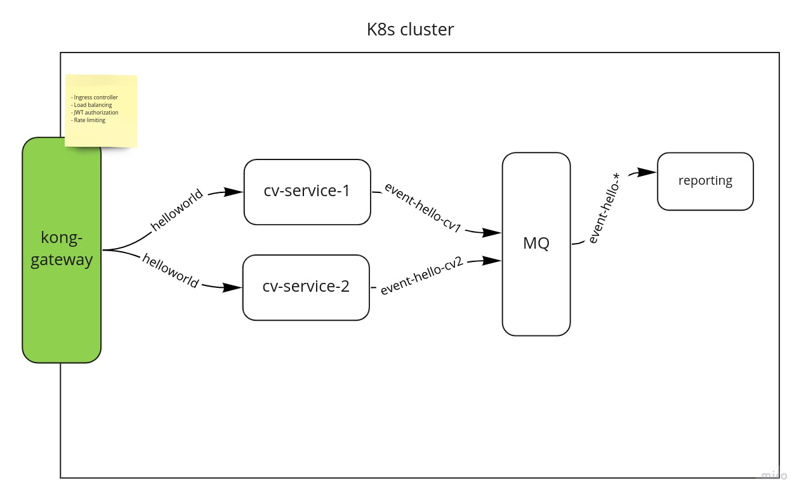

# cv-k8s

## Description
The goal of this project is to learn how to use Kubernetes and deploy a few services into it.

 

## Requirements
- [Docker](https://www.docker.com/)
- [Minikube](https://minikube.sigs.k8s.io/docs/start/)
- [Kubectl](https://kubernetes.io/docs/tasks/tools/#kubectl)
- [Python3](https://www.python.org/downloads/)
- [OpenSSL](https://www.openssl.org/)

 

### Services
- [Kong ingress controller](https://github.com/Kong/kubernetes-ingress-controller) as gateway, ingress controller, load balancer, authorization, rate limit, healthcheck
    - [Kong JWT plugin](https://docs.konghq.com/hub/kong-inc/jwt/) authorization using RSA
    - [Kong Correlation ID plugin](https://docs.konghq.com/hub/kong-inc/correlation-id/) to add unique ID header on requests/responses
    - [Kong Rate Limiting plugin](https://docs.konghq.com/hub/kong-inc/rate-limiting/) to limit the hiting on the api by period
- [cv-service-1](https://github.com/s1lv10fr4gn4n1/cv-service-1), it's a microservice placeholder for a future Computer Vision service api.
    - CI/CD using [CircleCi](https://circleci.com/)
    - The image is hosted at [Docker Hub](https://hub.docker.com/repository/docker/silviofragnani/cv-service-1) 
    - `cv1/healthcheck`
    - `cv1/helloworld`
- [cv-service-2](https://github.com/s1lv10fr4gn4n1/cv-service-2), it's a microservice placeholder for a future Computer Vision service api. 
    - CI/CD using [CircleCi](https://circleci.com/)
    - The image is hosted at [Docker Hub](https://hub.docker.com/repository/docker/silviofragnani/cv-service-2) 
    - `cv2/healthcheck`
    - `cv2/helloworld`
- [RabbitMQ](https://www.rabbitmq.com/) lightweight Message Queue to implement event-driven architecture
- [cv-reporting](https://github.com/s1lv10fr4gn4n1/cv-reporting), it's a microservice placeholder which consumes events produced by cv-service-1 and cv-service-2

 

### Diagram of k8s
 

 

 

---

 

### Starting Minikube
- run `minikube start` to start the k8s cluster on local machine
- run `kubectl get all` to check if the cli to issue commands to k8s is working fine

 

### Starting k8s cluster
Running `$ ./_k8s-apply.sh`, it will prepare the k8s cluster and make it ready.
- it runs the script `_rsa-generator.py` which will use `openSSL` to create the RSA public and private keys, and assign the public key to the k8s `Secret` in `kong-consumers.yaml` 
- it installs the Kong Ingress Controller using `kubectl apply -f https://bit.ly/k4k8s`
- it installs all the resources on the cluster `kubectl apply -f .`
- it runs the script `_jwt-generator.py` which will use the private and public RSA keys to create a valid JWT token and print out on terminal to be used later 

 

### Destroy a k8s cluster
This step is important in case the cluster is running in a cloud provider, besides deleting all the services, it will also delete the loadbalancer which is usually is costly
- run `$ ./_k8s-delete.sh`

 

### Start load balancer on Minikube 
- `minikube tunnel -c`
- it will create an IP pointing to Kong gateway (load balancer) 

 

### Get the IP from Kong-Proxy (load balancer)
- `export PROXY_IP=http://$(kubectl get svc --namespace kong kong-proxy -o jsonpath='{.status.loadBalancer.ingress[0].ip}')`
- it will expose on cmd the PROXY environment variable pointing to Kong gateway

 

### Verify connection with Kong gateway
- create an environment variable named JWT_TOKEN using the output from `k8s.sh`
    - `export JWT_TOKEN=eyJ0eXAiOiJKV1QiLCJhbGciOiJ....`
- execute `curl -i -H "Authorization: Bearer ${JWT_TOKEN}" $PROXY_IP/cv1/helloworld` 
    - it should result on `HTTP/1.1 200 OK`
    - it should return `helloworld <uuid>` output, where the uuid will be different for each instance of the service `cv1` to help identify the loadbalancer is working properly

 

### Test Kong [rate limit plugin](https://docs.konghq.com/hub/kong-inc/rate-limiting/)
- execute the following loop and from tiem to time the api will show HTTP 429 api rate limit exceeded
    - `while true; do curl -i -H "Authorization: Bearer ${JWT_TOKEN}" $PROXY_IP/cv1/helloworld; sleep 0.001; clear; done` 

      

---  
 

## Coming up
- cv1 and cv2 implementation
- front end 
- helm
- helmfile
